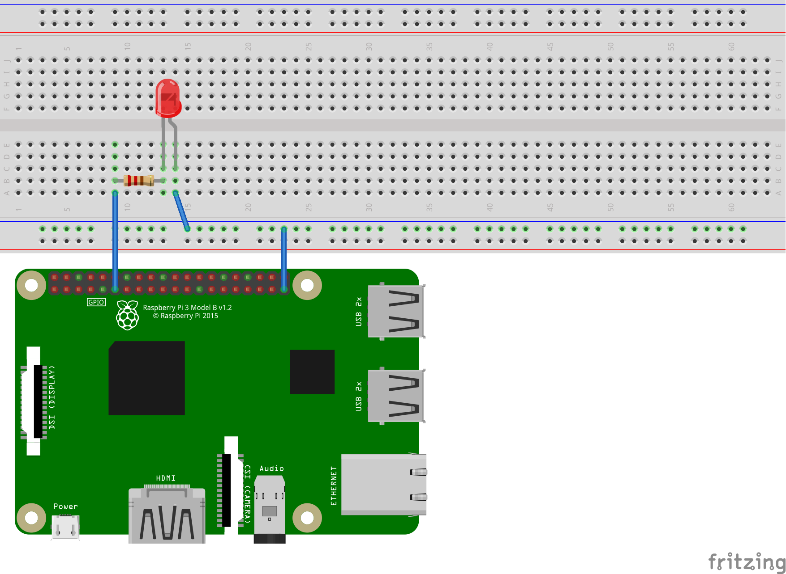

# Blink an LED with .NET Core on a Raspberry Pi 3

You can use .NET Core to control [LEDs](https://learn.adafruit.com/all-about-leds).

This [sample](Program.cs) demonstrates the most basic usage of the .NET Core GPIO library. It blinks an LED at given interval by repeatedly toggling a GPIO pin on and off, which powers the LED.

The program produces the following output, as it toggles the LED.

```console
Let's blink an LED!
GPIO pin enabled for use: 17
Light for 1000ms
Dim for 200ms
Light for 1000ms
Dim for 200ms
Light for 1000ms
Dim for 200ms
```

The following [fritzing diagram](rpi-led.fzz) demonstrates how you should wire your device in order to run the [sample C# code](Program.cs) for this sample. It uses the GND and GPIO 17 pins on the Raspberry Pi.



See [Using .NET Core for IoT Scenarios](../README.md) for more samples.